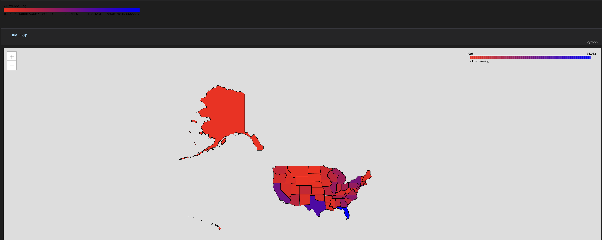

# Geospatial Visualization: State Parks, F1 Circuits, and US Housing Inventory

A cleaned-up lab from an applied Pandas course, this one's a tour through geospatial visualization in Python rather than a single dataset. I plot Indiana state parks as markers on an interactive map, connect them with a route, map Formula 1 circuit locations worldwide, then merge Zillow's state-level housing inventory data with US state boundary shapefiles to build a choropleth map.

## What's in this repo

- `geospatial-mapping-parks-f1-housing.ipynb` — the full analysis
- `images/` — screenshots of the rendered maps (the notebook itself has the heavy map outputs cleared to keep the file size reasonable; rerun the relevant cells locally to regenerate them)
- `README.md` — this file

## What I did

- Built a GeoDataFrame from a list of Indiana state park coordinates and plotted them on a folium map, first as simple circle markers, then as full marker pins
- Added popups labeling each park by name, then connected all the points with a route line using `folium.PolyLine`
- Read in a real-world dataset of Formula 1 circuit locations and plotted every circuit worldwide on a map, then zoomed in on a single circuit automatically
- Cleaned and merged Zillow's state-level housing inventory time series with a US state boundary shapefile (geopandas), converting coordinate reference systems as needed so the join lined up correctly
- Built a choropleth map coloring each state by average housing inventory using a custom linear color scale

## The maps

**Indiana state parks, plotted as simple markers:**

**Same parks, with full marker pins and labeled popups:**

**Parks connected by a route line:**

**Formula 1 circuit locations worldwide:**

**Choropleth map of average housing inventory by state:**

## The short version

Folium makes it straightforward to go from a handful of coordinates to an interactive, labeled map, and the same workflow scales cleanly from a dozen state parks up to a global dataset of racing circuits. The choropleth step was the more involved part. matching state names between the housing data and the shapefile, reprojecting the coordinate reference system, and building a custom color scale all had to line up correctly before the final map made sense.

## Tools

Pandas, geopandas, folium, and branca.
